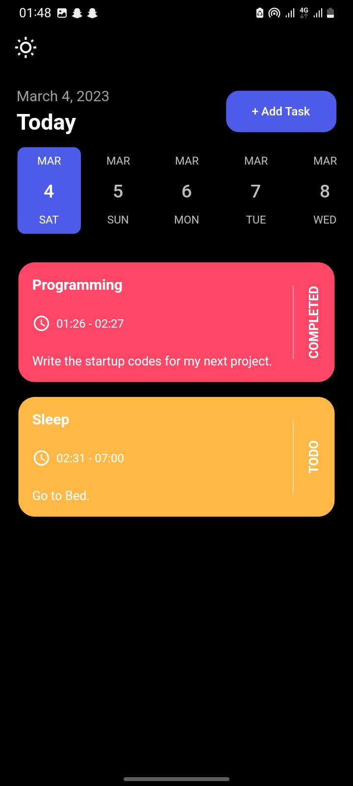
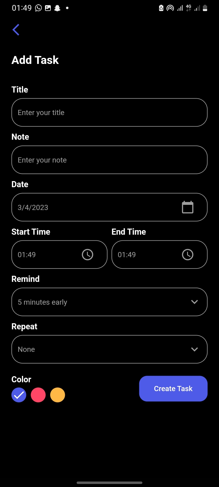
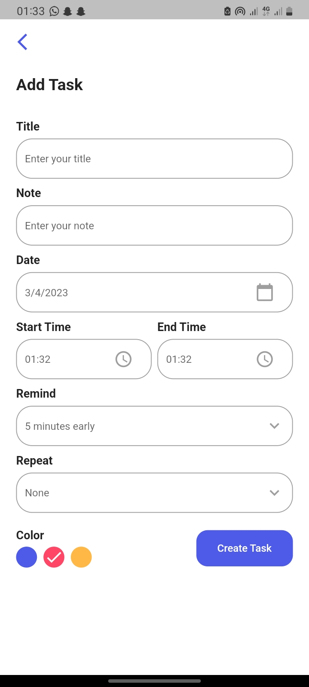
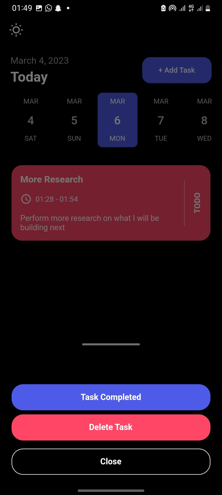
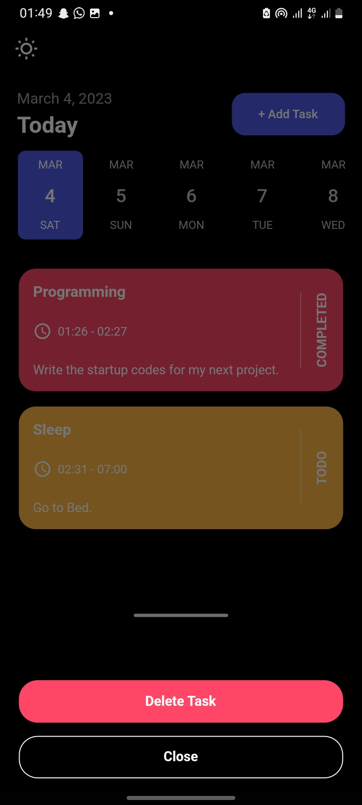

# task_manager_app

A task management application. This application makes use of Sqlite for the creating of tables and saving of tasks.
It also makes use of all Sqflite CRUD operations. The application also has scheduled and immediate notifications which were implemented using Flutter local notification package.
There is a also the toggle theme features which enables the user to switch the UI between Light and dark modes.

